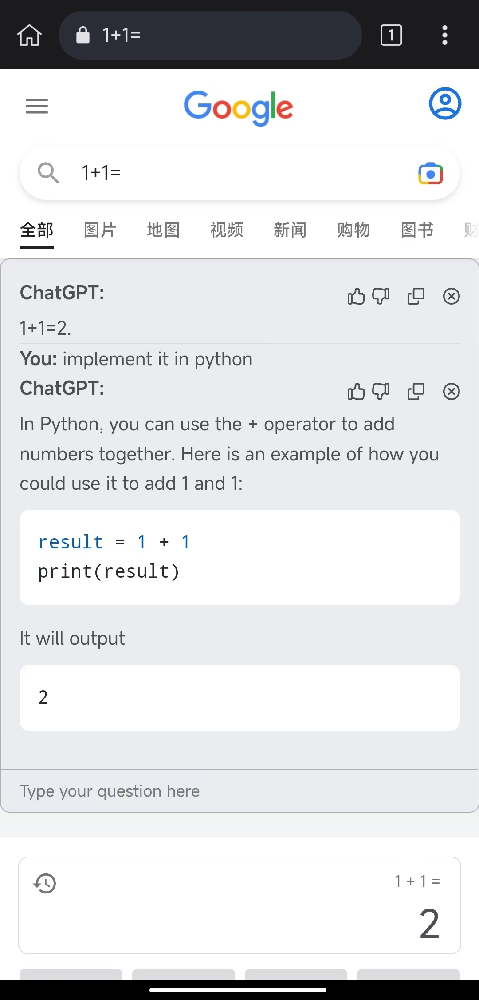

# ChatGPT for Search Engine

[Installation](#installation)

A browser extension to display ChatGPT response alongside Search Engine results, supports Chrome/Edge/Firefox/Safari(macOS) and
Android.

Support most search engines, including Google, Bing, Yahoo, DuckDuckGo, StartPage, Baidu, Kagi, Yandex, Naver, Brave,
Searx, Ecosia, Neeva in total.

Request more search engine support in [#6](https://github.com/josStorer/chatGPT-search-engine-extension/issues/6)

See more in [Releases](https://github.com/josStorer/chatGPT-search-engine-extension/releases)
and [Pre-release build](https://github.com/josStorer/chatGPT-search-engine-extension/actions/workflows/pre-release-build.yml)

## Notice

This repository exists only to support some features that are not supported or denied
in [upstream](https://github.com/wong2/chat-gpt-google-extension), and for ethical reasons, I have not uploaded it to
any app store. It isn't related to any extensions of the same name that may exist in some app store

## Diff with upstream

Details:

- Support StartPage, Ecosia, Neeva, Searx(searx.tiekoetter.com, searx.fmac.xyz, searx.be and more)
- Android support
- Safari(macOS) support
- Custom mount point (e.g. for some unsupported engines)
- Preview your setting (e.g. theme, mount point) in realtime
- Katex: [upstream#75](https://github.com/wong2/chat-gpt-google-extension/pull/75)
- Linkify in ReactMarkdown
- Interactive mode: [upstream#103](https://github.com/wong2/chat-gpt-google-extension/pull/103), now support generating
  separate sessions for each page
- Fix answer being overwritten due to "network error" or other errors
- Theme switcher: [#9](https://github.com/josStorer/chatGPT-search-engine-extension/pull/9)
- Collapse answers
- Popup Setting Window (Upstream has switched to a standalone options page)
- Allow `Insert chatGPT at the top of search results` in Setting Window
- Switch to webpack
- Javascript
- See more in [Releases](https://github.com/josStorer/chatGPT-search-engine-extension/releases)

## Upstream supports, but not here

Details:

(I don't think these contents are very valuable, but I could be wrong, so if you think of some suitable application
scenario or related need, please create an issue)

1. Upstream supports setting the desired language, and will force the relevant words to be inserted at the end after you
   enter the question

    - but I think, users always expect to get the language corresponding to their question, when you want to get a
      different language, you should take the initiative to specify when searching, which is also consistent with the
      habits of using search engines, and this fork supports interactive mode, you can also continue to tell chatGPT
      what you want. Once you set up forced insertion, it will change the actual content of the user's question, for
      example, when you configure French and search in English, chatGPT will always reply to you in French, when you
      expect a reply in English, you will have to open the settings page, make changes, then refresh and ask the
      question again, which I think is a very bad process

2. The upstream extension popup window has an embedded chatGPT page (iframe)

    - but you have to open the chatGPT website and log in to use it, so I think, in that case, why not use it directly
      on the official website? In addition, interactive mode is already supported here, and each page can be used as a
      separate session, so this feature is less necessary

## Preview

- [SearchEngines](screenshot/engines/README.md)
- Code highlight, interactive mode, dark mode, copy/collapse answers, theme switcher and more

  (Click on the extension icon to open the setting window)
  
- LaTeX
  
- Android
  

## Installation

### Install to Chrome/Edge

1. Download `chromium.zip` from [Releases](https://github.com/josStorer/chatGPT-search-engine-extension/releases).
2. Unzip the file.
3. In Chrome/Edge go to the extensions page (`chrome://extensions` or `edge://extensions`).
4. Enable Developer Mode.
5. Drag the unzipped folder anywhere on the page to import it (do not delete the folder afterwards).

### Install to Firefox

1. Download `firefox.zip` from [Releases](https://github.com/josStorer/chatGPT-search-engine-extension/releases).
2. Unzip the file.
3. Go to `about:debugging`, click "This Firefox" on the sidebar.
4. Click "Load Temporary Add-on" button, then select any file in the unzipped folder.

### Install to Android

1. Install [Kiwi Browser](https://play.google.com/store/apps/details?id=com.kiwibrowser.browser) or other mobile browsers that support installing extensions from local files.
2. Download `chromium.zip` from [Releases](https://github.com/josStorer/chatGPT-search-engine-extension/releases) on
   your phone.
3. Go to `Extensions` and enable developer mode.
4. Click `+ (from .zip/.crx/.user.js)` button and load the downloaded zip file.
5. Click the browser option button, scroll down and click on the extension icon to open the setting window.
6. Enable `Insert chatGPT at the top of search results`.

### Install to Safari(macOS)

1. Download `safari.dmg` from [Releases](https://github.com/josStorer/chatGPT-search-engine-extension/releases).
2. Double-click `safari.dmg` to open it and drag the extension’s icon to your Applications folder
3. Run this extension in your Applications folder
4. Click `Quit and Open Safari Settings...`
5. Click `Advanced` in Safari Settings and then turn on `Show Develop menu in menu bar`
6. Click `Develop` in Safari menu bar and then turn on `Allow Unsigned Extensions`
7. You will see this extension in Extensions of Safari Settings, turn on it
8. Click `Always Allow on Every Website`

## Enable for single website

1. Click on the extension icon to open the popup setting window.
2. Click `Advanced`.
3. Input the website name (of the hostname) in `Custom Site Regex`, e.g. google
4. Enable `Only use Custom Site Regex...`

## Build from source

1. Clone the repo
2. Install dependencies with `npm install`
3. `npm run build`
4. Load `build/chromium/` or `build/firefox/` directory to your browser

## My contributions

- [Pull Requests](https://github.com/wong2/chat-gpt-google-extension/pulls?q=is%3Apr+author%3AjosStorer+)
- ### Other
    - Merge and improve some PRs
    - Support for most search engines
    - Android support
    - Safari(macOS) support
    - Custom mount point
    - Preview your setting in realtime
    - Fix answer being overwritten due to "network error" or other errors
    - Linkify in ReactMarkdown
    - Generate separate sessions for each page
    - Code highlight
    - Collapse answers
    - Copy answers
    - Allow insert chatGPT at the top of search results
    - Automated build workflow (with esbuild/webpack)
    - Verify search engine configs automatically
    - See more in [Releases](https://github.com/josStorer/chatGPT-search-engine-extension/releases)

## Credit

This project is forked from [wong2/chat-gpt-google-extension](https://github.com/wong2/chat-gpt-google-extension) and
detached since 14 December of 2022

The original repository is inspired by [ZohaibAhmed/ChatGPT-Google](https://github.com/ZohaibAhmed/ChatGPT-Google) ([upstream-c54528b](https://github.com/wong2/chatgpt-google-extension/commit/c54528b0e13058ab78bfb433c92603db017d1b6b))
