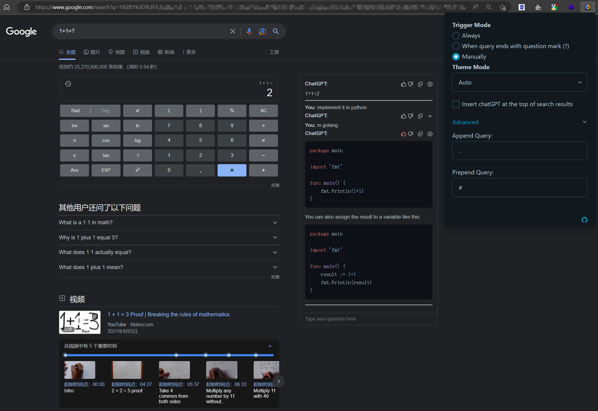
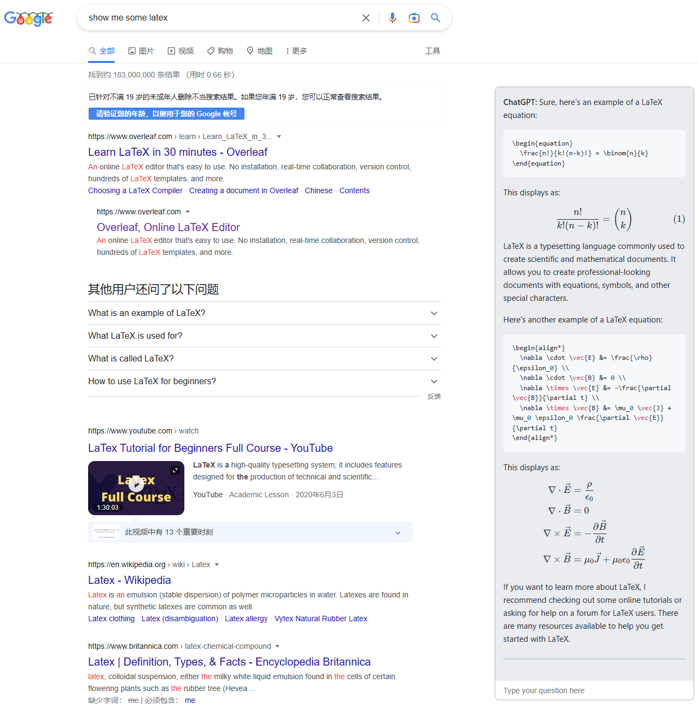
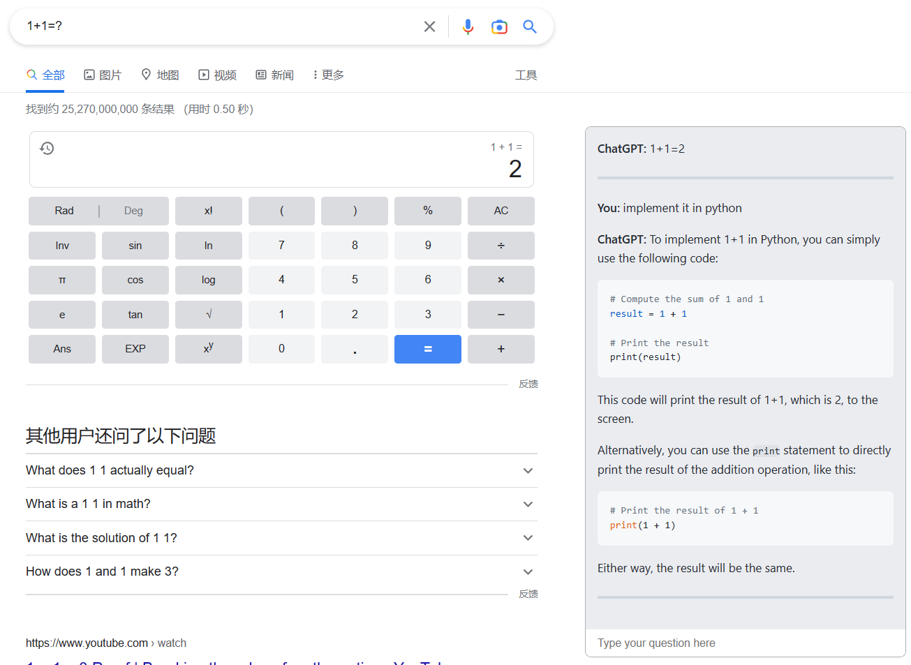

# ChatGPT for Search Engine

A browser extension to display ChatGPT response alongside Search Engine results, supports Chrome/Edge/Firefox

Support more search engines, including Google, Bing, Yahoo, DuckDuckGo, StartPage, Baidu, Kagi, Yandex, Naver, Brave,
Searx, Ecosia in total.

Request more search engine support in [#6](https://github.com/josStorer/chat-gpt-search-engine-extension/issues/6)

And here perhaps merges PR faster than the original repo

See more in [Releases](https://github.com/josStorer/chat-gpt-search-engine-extension/releases)
and [Pre-release build](https://github.com/josStorer/chat-gpt-search-engine-extension/actions)

### Diff with upstream:

- Support StartPage, Baidu, Ecosia, Searx(searx.tiekoetter.com, searx.fmac.xyz, searx.be and more)
- Katex: [wong2#75](https://github.com/wong2/chat-gpt-google-extension/pull/75)
- Linkify in ReactMarkdown
- Interactive mode: [wong2#103](https://github.com/wong2/chat-gpt-google-extension/pull/103), now support generating
  separate sessions for each page
- Fix answer being overwritten due to "network error"
- Code highlight
- Switch to webpack

### Preview:

- [SearchEngines](screenshot/engines/README.md)
- Code highlight and dark mode
  
- LaTeX
  
- Interactive mode
  

## Installation

### Install to Chrome/Edge

1. Download `chromium.zip` from [Releases](https://github.com/josStorer/chat-gpt-search-engine-extension/releases).
2. Unzip the file.
3. In Chrome/Edge go to the extensions page (`chrome://extensions` or `edge://extensions`).
4. Enable Developer Mode.
5. Drag the unzipped folder anywhere on the page to import it (do not delete the folder afterwards).

### Install to Firefox

1. Download `firefox.zip` from [Releases](https://github.com/josStorer/chat-gpt-search-engine-extension/releases).
2. Unzip the file.
3. Go to `about:debugging`, click "This Firefox" on the sidebar.
4. Click "Load Temporary Add-on" button, then select any file in the unzipped folder.

## Build from source

1. Clone the repo
2. Install dependencies with `npm install`
3. `npm run build`
4. Load `build/chromium/` or `build/firefox/` directory to your browser

## My contributions:

- [Branches](https://github.com/josStorer/chat-gpt-search-engine-extension/branches)
- [Pull Requests](https://github.com/wong2/chat-gpt-google-extension/pulls?q=is%3Apr+author%3AjosStorer+)
- ### Other
    - Merge and improve some PRs
    - Fix answer being overwritten due to "network error"
    - Linkify in ReactMarkdown
    - Generate separate sessions for each page
    - Code highlight
    - Switch to webpack

## Credit

This project is forked from [wong2/chat-gpt-google-extension](https://github.com/wong2/chat-gpt-google-extension) and
detached since 14 December of 2022
